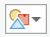

# Add a configuration for country indicator for MIL-STD-2525C

## Update configuration for country indicator

The example below illustrates how to add a country indicator with an option to display it as the country abbreviation or the flag in the MIL-STD-2525C dictionary. This can be achieved by creating a custom dictionary that is a modified version of the MIL-STD-2525C dictionary with new symbols and an updated script that defines a new country property and an option for how it is displayed.

## Create a custom dictionary
In order to modify the dictionary for MIL-STD-2525C it is necessary to create a custom dictionary.
1. Download the [Joint Military Symbology MIL-STD-2525C](https://www.arcgis.com/home/item.html?id=4e31ddc1f609432d98bd400f87f6b7bf) style from ArcGIS Online.
2. Open the copy of mil2525c.stylx in an SQLite database editor.
3. Update the `dictionary_name` to the name of the custom dictionary.
4. Make the style file editable by changing the `readonly` value to `false`.

## Add new symbols to the style
New symbols for the country indicator must be added to the dictionary style. Each country will have two symbols that can be used as the country indicator. One will be the country flag which can be an SVG file that is imported into a point symbol. The other will be the abbreviation of the country. This symbol will be a point symbol with a text element within a marker symbol layer. The option that is set in the configuration will determine which symbol is selected.

1. _Create a new temporary style:_ Since the dictionary style is very large it is better to create and modify symbols in a separate temporary style and then merge them back into the dictionary style once they are finalized. In ArcGIS Pro, on the Insert tab, in the Styles group, click New and click New Mobile style to add a new style to the project.

2. _Open the temporary style in a Catalog view:_ In the Catalog view, in the Contents pane, expand the Styles folder. Click the temporary style.

3. _Create new flag point symbol:_ The flag symbol can be created by importing an SVG file of the flag into a marker symbol layer in a point symbol.

  a. _Add a new point symbol:_ With the temporary style active, click the Manage tab on the ribbon, in  Create group, click open the New Item menu and click Point Symbol. A new point symbol is added to the style.

  b. _Edit the metadata:_ Click the new point symbol to highlight it. In the Details panel, on the Description tab, update the name of the symbol and set the appropriate category and tags. (If necessary, on the View tab, in the Options group, check Show Details Panel.) Set the key to contain country, the abbreviation for the country, and flag. For example, `country_US_flag`. The convention for the key is used in the script. Click Apply to save your changes.

  c. _Import the flag from an SVG file:_ In the Details panel, on the Properties tab, click the Layers tab (). Under the Appearance heading, click File and browse to the SVG or EMF file of the flag. EMF is also supported for vector markers. Or, change the marker layer type from Shape Marker to Picture Marker and click File to browse to a BMP, JPEG, GIF, or PNG file of the flag.

  d. _Update the properties for the flag symbol:_ Under the Appearance heading set the Size to 8 points. Under the Position heading adjust the Anchor Point so that the flag is positioned as desired. For example, to place the flag on the outside of the top right corner of the frame, set the relative anchor point to X = -225% and Y = -200%.

4. _Author text symbol for label:_ The abbreviation symbol will be a point symbol with a marker element containing text. The symbol for that text must be first authored as a text symbol that is then applied to the marker.

  a. _Create a text symbol:_ Because this symbol does not need to be merged into the dictionary style it can be created in your Favorites style (or in another custom style.) Open your Favorites style. Click the Manage tab on the ribbon, in the Create group, click the New Item menu and click Text Symbol. Click the new text symbol to highlight it.

  b. _Update the metadata of the point symbol:_ On the Description tab, change the name of the symbol to something descriptive. Because this symbol will not be directly consumed by the dictionary there is no need to set a specific key.

  c. _Update the font and size:_ On the Properties tab, on the General tab, under the Appearance heading, change the Size to 6 pts and change the Font Style to Bold to match the existing labels in the military symbols.

  d. _Add a halo:_ Under the Halo heading, open the Halo Symbol menu and click the White fill polygon symbol. Change the Size to 0.5 points and click Apply to save the edits.

5. _Create new abbreviation point symbol:_ The abbreviation symbol will be a point symbol with the two-letter abbreviation for a country.

  a. _Add a new point symbol:_ Browse to and highlight the temporary style. Open the New Item menu and click Point Symbol to add a new point symbol to the style.

  b. _Edit the metadata:_ Click the new point symbol to highlight it. On the Description tab, update the Name, Category, and Tags of the symbol. Modify the Key to contain country and the abbreviation for the country. For example, `country_US`. The two-letter abbreviation is the value that is attributed on the data in an attribute field that is then connected to the country indicator property. The convention for the Key will be used in the script. Click Apply.

  c. _Create abbreviation symbol:_ Click the Properties tabs and click the Layers tab (). The abbreviation symbol will be a text element within a marker symbol layer. An easy way to add a marker layer with text is to select one from the provided shapes. Under the Appearance heading, open the Form drop down () and click the 1 symbol. Change the Text String to the two-letter abbreviation (e.g. `US`).

  d. _Apply new text symbol:_ Open the Shape text symbol menu and click More Text Symbols. In the Choose a text symbol dialog box, select the text symbol created in the previous steps and click OK.

  e. _Update position of the text:_ To place the abbreviation in the same location as the flag the text alignment and offsets must be adjusted. The text should be a left horizontal alignment and aligned to the bottom vertically to place it outside the top right corner of the frame. Set Offset X to 18 and Offset Y to 14.


## Update configuration file

The dictionary configuration file controls the symbology and text fields that are shown in the Dictionary Symbology pane. This file also controls the options that are shown in the configuration section of the Symbology pane. To connect the country indicator to an attribute field in the data, a new symbology field must be added. To toggle between the flag or the two-letter abbreviation, a new option must be added to the configuration section. To modify the dictionary configuration, copy it from the meta table in the .stylx file and paste the dictionary configuration file in Notepad++. See [Tips for creating custom dictionaries](tips-for-creating-custom-dictionaries.md).

1. _Add an option to the configuration section:_ The configuration section of the Dictionary Symbology pane has multiple options for how all the symbols are displayed. For example, you can set the color for framed symbols to be the light, medium, or dark version of the symbols. For the country indicator, add an option called `country` that allows the user to choose to show the abbreviation or the flag. The name is what the control is called in the pane. The value sets the default option and domain are the choices shown in the drop down.

```
  }, {
   "name": "country",
   "value": "ABBREVIATION",
   "domain": ["ABBREVIATION", "FLAG"],
   "info": "indicates if the flag graphic is used"
  }

  ```

2. _Add new symbol field:_ In the configuration file add `countrycode` to the list of symbol fields. This adds `countrycode` in the Symbology Fields section of the Dictionary Symbology pane.

  `"symbol": ["sidc", "affiliation", "extendedfunctioncode", "status", "hqtffd", "echelonmobility", "civilian", "direction", "countrycode"],`

## Update the script
Once the new symbols have been added and the configuration file has been updated, the logic for building the key associated with the country indicator must be added to the script. To modify the script, copy it from the meta table in the .stylx file and paste the dictionary script file in Notepad++. See [Tips for creating custom dictionaries](tips-for-creating-custom-dictionaries.md).

1. _Declare a variable for the country code:_ At the top of the script there is a list of variables. Add a variable named `_country_code` to that list. This is the 2-letter code for the country that is in the data (e.g. "US")

```
var _coding_scheme = '-';
var _affiliation = '-';
var _battle_dimension = '-';
var _status = '-';
var _function_code = '------';
var _HQ_TF_FD = '-';
var _echelon_mobility = '-';
var _order_of_battle = '-';
var _country_code = '--';

```

2. _Identify which character should be extracted for the two-digit country code in the full SIDC value:_ In the section immediately under the list of variables there is logic for how the 15-character SIDC code is decomposed. The country code is the 13th and 14th digits in the 15-character code. To extract this code, the mid function is used specifying the starting position and how many digits.

```
var _sidc_len = count($feature.sidc);
if (_sidc_len == 15) {

 // decompose sidc into individual fields

 _coding_scheme = mid($feature.sidc, 0, 1);
 _affiliation = mid($feature.sidc, 1, 1);
 _battle_dimension = mid($feature.sidc, 2, 1);
 _status = mid($feature.sidc, 3, 1);
 _function_code = mid($feature.sidc, 4, 6);
 _HQ_TF_FD = mid($feature.sidc, 10, 1);
 _echelon_mobility = mid($feature.sidc, 11, 1);
 _order_of_battle = mid($feature.sidc, 14, 1);
 _country_code = mid($feature.sidc, 12, 2);
} else if (_sidc_len == 0) {

```

3. Assign country code from field in configuration, if the full SIDC value is not specified. If the Extended Function Code is used instead of the SIDC it is necessary to map the country code to a separate attribute field. In the script, it must be defined that the SIDC is not specified in the section for reading the individual attributes.

```
} else if (_sidc_len == 0) {

 // read individual attributes if sidc not specified

 if (count($feature.extendedfunctioncode) == 10) {
  _coding_scheme = mid($feature.extendedfunctioncode, 0, 1);
  _affiliation = mid($feature.extendedfunctioncode, 1, 1);
  _battle_dimension = mid($feature.extendedfunctioncode, 2, 1);
  _status = mid($feature.extendedfunctioncode, 3, 1);
  _function_code = mid($feature.extendedfunctioncode, 4, 6);
 }
 if (count($affiliation) == 1)
  _affiliation = $feature.affiliation;
 if (count($feature.status) == 1)
  _status = $feature.status;
 if (count($feature.hqtffd) == 1)
  _HQ_TF_FD = $feature.hqtffd;
 if (count($feature.echelonmobility) == 1)
  _echelon_mobility = $feature.echelonmobility;
 if (count($feature.countrycode) == 2)
  _country_code = $feature.countrycode;
}
```

4. _Add a variable for the new configuration option:_ Near the beginning of the script there is a list of configuration options. The new `country` option must be added to that list.

```
// configuration options

var _show_frame = $config.frame != 'OFF';
var _show_icon = $config.icon != 'OFF';
var _show_fill = $config.fill != 'OFF' && !_is_sea_mine;
var _show_amplifiers = $config.amplifiers != 'OFF';
var _show_text = $config.text != 'OFF';
var _use_conditionalt = $config.condition != 'PRIMARY';
var _use_cp = $config.model == 'ORDERED ANCHOR POINTS';
var _use_flag = $config.country != 'ABBREVIATION';

```

5. _Add logic for building country indicator key:_ A different key must be returned for both the flag and the abbreviation.  When the key that is built by the script matches the key that is assigned to the symbol, the symbol is drawn as part of the complete military symbol. The `country` option in the configuration drives which key is returned. For example, if it is set to flag and the value in the data is US, a key of `country_US_flag` is generated. To ensure that the country indicator is only shown when all amplifiers are on, the code below should be added into the amplifiers section.

```
// amplifiers
// country indicator

  if (!isempty(_country_code)) {
   if (_use_flag) {
    //flag country indicator
    keys += ';country_' + _country_code + '_' + 'flag';
   } else {
    //Abbreviation country indicator
    keys += ';country_' + _country_code;
   }
  }

  ```

Information on Arcade functions is available at https://developers.arcgis.com/arcade/function-reference/

## Verify syntax

Once the script has been updated it is good practice to verify the syntax of the script before adding it back into the dictionary. The syntax of the script can be verified online using the Arcade playground.
1. Go to https://developers.arcgis.com/arcade/playground/
2. Copy the text from [mil2525c_b2_app6b_arcade_vars.json](../variable_declarations/mil2525c_b2_app6b_arcade_vars.json) into the expression window. These are values that you can change to match the symbols you are adding. The values are used for the string that is returned in the results.
3. _Add new country configuration option below other variables:_
`country: "ABBREVIATION",`
4. Copy the text from the edited dictionary script. Paste below the text from `mil2525c_b2_app6b_arcade_vars`.
5. Click Test. If there is a syntax error, the line with the error is reported in the results. If there are no errors the results show a string of the values returned. You can change the values at the top to test what different keys are returned.

## Replace the script and update the dictionary
Once the script is verified in can be added back into the .stylx file meta table and the new symbols added to the dictionary style.
1. To add the script back into the dictionary, copy and paste the script into `dictionary_script` in the meta table of the .stylx.
2. Add the new country indicator symbols to the dictionary style. While the symbols in the temporary style can be copied and pasted back into the dictionary manually, this may change the keys if they already exist. It is important that the keys remain the same. In order to preserve the key on the new symbol the [Merge Style add-in](../Add-Ins/MergeStyles) can be used.

  a. Add the Merge Style add-in to ArcGIS Pro.

  b. In ArcGIS Pro, open the add-in from the Add-In ribbon

  c. For the Style to Merge Into option, browse to and select the custom dictionary style.

  d. For the Style to Merge option, browse to and select the editing style.

  e. Check Replace keys.

  f. Click Merge Style. Ensure that symbols are being merged into the correct style and click OK. A message appears when the merging is complete stating how many symbols were copied. If the style is already in the current ArcGIS Pro project and there is a schema lock, an error stating the style is read-only may appear. In this case, remove the style from the ArcGIS Pro project before merging.
