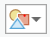

# Adding a Configuration for Country Indicator for MIL-STD-2525C

## Updating configuration for Country Indicator

The example below illustrates how to add a country indicator with an option to display it as the country abbreviation or the flag in the MIL-STD-2525C dictionary. This can be achieved by creating a custom dictionary that is a modified version of the MIL-STD-2525C dictionary with new symbols and an updated script that defines a new country property and an option for how it is displayed.

## Create a Custom Dictionary
In order to modify the dictionary for MIL-STD-2525C it is necessary to create a custom dictionary.
1. Copy the `mil2525c.stylx` file from `…/Resources/Dictionaries/mil2525c` in the install location and paste into the location the custom dictionary will be stored.
2. Open the copy of mil2525c.stylx in an SQLite database editor
3. Update the `dictionary_name` to the name of the custom dictionary
4. Set the style file to editable by changing the `readonly` value to `false`

## Add new symbols to style
New symbols for the country indicator need to be added to the dictionary style. Each country will have two symbols that can be used as the country indicator. One will be the country flag which can be an SVG that is imported into a point symbol. The other will be the abbreviation of the country. This symbol will be a point symbol with a text symbol within markers. The option that is set in the configuration will determine which symbol is selected. 

1. _Create a new editing style_. Since the dictionary style is very large it is better to create and modify symbols in a separate editing style and then merge them back into the dictionary style once they are finalized. To add the new style in ArcGIS Pro, select **New > New Mobile Style** from the style group on the Insert tab and create the new style.

2. _Open the editing style in the catalog view_. Double click on Styles in the Catalog window, then double click on the editing style.

3. _Create new flag point symbol_. The flag symbol can be created by importing an SVG of the flag into a point symbol.

  a. _Add a new point symbol_. With the editing style open, go to the Styles tab in the ribbon. In the Create group, click on the New Item drop down menu and select Point Symbol. A new point symbol will be added to the style.
  
  b. _Edit the metadata_. Double click on the new point symbol. In the Description tab update the name of the symbol and set the appropriate category and tags. Set the key to contain country, the abbreviation for the country, and flag. For example, `country_US_flag`. The convention for the key will be used in the script. Click Apply.
  
  c. _Import flag SVG_. Switch to the Properties tabs and select Layers (). Click File and navigate to the SVG for your flag. EMF is also supported for vector markers. A picture can also be used if imported into a picture marker. Bitmap, jpeg, gif, and png are supported.
  
  d. Update the properties for the flag symbol. In the Appearance group set the size to 8 points. In the Position group set the anchor point so that the flag is positioned as desired. For example, if you wanted the flag on the outside of the top, right corner of the frame the relative anchor point would be X = -225% and Y = -200%

4. Author text symbol for label. The abbreviation symbol will be a point symbol with a marker containing text. The symbol for that text needs to be authored as a text symbol that can be applied to the marker.

  a. Create a text symbol. Since this symbol does not need to be merged into the dictionary style it can be created in your Favorites or in another style. Navigate to you Favorites style and from the New Item drop down select Text symbol. Select the new text symbol.
  
  b. Update meta data. Change the name of the symbol in the Descriptions tab to something descriptive. Since this symbol will not be directly consumed by the dictionary there is no need to set a specific key.
  
  c. Update font and size. In the symbol editor go to the Properties tab. In the Appearance group change the size to 6 points and change the Font Style to Bold to match the existing labels in the military symbols.
  
  d. Add a halo. In the Halo section select the white fill polygon symbol from the Halo Symbol drop down. Change the size to 0.5 points. Click Apply.

5. Create new abbreviation point symbol. The abbreviation symbol will be a point symbol with the two-letter abbreviation for a country.

  a. _Add a new point symbol_. Navigate to the editing style and from the New Item drop down menu and select Point Symbol. A new point symbol will be added to the style.
  
  b. _Edit the metadata_. Double click on the new point symbol. In the Description tab update the name of the symbol and set the appropriate category and tags. Set the key to contain country and the abbreviation for the country. For example, `country_US`. The two-letter abbreviation will be the value that is attributed on the data in an attribute field that is mapped to the country indicator property. The convention for the key will be used in the script. Click Apply.
  
  c. _Create abbreviation symbol_. Switch to the Properties tabs and select Layers (). The abbreviation symbol will be text within a marker. An easy way to add a marker with text is to select one from the provided shapes. In the Appearance group, select the 1 symbol from the Form drop down (). Change the Text String to the two-letter abbreviation (e.g. `US`).
  
  d. _Apply new text symbol_. Click on the Shape Text Symbol drop down and choose More Text Symbol. Select the text symbol created in the previous steps and click OK.
  
  e. _Update position of the text_. To place the abbreviation in the same location as the flag the text alignment and offsets can be adjusted. The text should be a left horizontal alignment and be aligned to the bottom vertically if it will be placed outside the top right corner of the frame. Set Offset X to 18 and Offset Y to 14.


## Update Configuration File

The dictionary configuration file controls the symbology and text fields that are shown in the dictionary symbology pane. It also controls the options that are shown in the configuration section of the symbology pane. To be able to map the country indicator to an attribute field in the data a new symbology field needs to be added. In order to toggle between the flag or the two-letter abbreviation a new option needs to be added to the configuration section. To modify the dictionary configuration, copy it from the meta table in the .stylx file and paste the dictionary configuration file in Notepad ++. See [Tips for Creating Custom Dictionaries](tips for creating custom dictionaries.md).

1. Add option to configuration section. The configuration section of the dictionary symbology pane has multiple options for how all the symbols are displayed. For example, you can set the color for framed symbols to be the light, medium or dark version of the symbols. For the country indicator, add an option called `country` that allows the user to choose to show the abbreviation or the flag. The name is what the control will be called in the pane. The value sets the default option and domain are the choices shown in the drop down.

```
  }, {
   "name": "country",
   "value": "ABBREVIATION",
   "domain": ["ABBREVIATION", "FLAG"],
   "info": "indicates if the flag graphic is used"
  }
  
  ```

2. Add new symbol field. In the configuration file add `countrycode` to the list of symbol fields. This will add `countrycode` in the Symbology Fields section of the dictionary symbology pane.

  `"symbol": ["sidc", "affiliation", "extendedfunctioncode", "status", "hqtffd", "echelonmobility", "civilian", "direction", "countrycode"],`

## Update Script
Once the new symbols have been added and the configuration file has been updated, the logic for building the key associated with the country indicator needs to be added to the script. To modify the script, copy it from the meta table in the .stylx file and paste the dictionary script file in Notepad++. See [Tips for Creating Custom Dictionaries](tips for creating custom dictionaries.md).

1. Declare a variable for the country code. At the top of the script there is a list of variables. Add a variable named `_country_code` to that list. This will be the 2-letter code for the country that is in the data (e.g. "US")

```
var _coding_scheme = '-';
var _affiliation = '-';
var _battle_dimension = '-';
var _status = '-';
var _function_code = '------';
var _HQ_TF_FD = '-';
var _echelon_mobility = '-';
var _order_of_battle = '-';
var _country_code = '--';

```

2. Identifying which character should be extract for the two-digit country code in the full SIDC value. In the section immediately under the list of variables there is logic for how the 15-character SIDC code is decomposed. The country code is the 13th and 14th digits in the 15-character code. To do this the mid function is used specifying the starting position and how many digits.

```
var _sidc_len = count($sidc);
if (_sidc_len == 15) {

 // decompose sidc into individual fields
 
 _coding_scheme = mid($sidc, 0, 1);
 _affiliation = mid($sidc, 1, 1);
 _battle_dimension = mid($sidc, 2, 1);
 _status = mid($sidc, 3, 1);
 _function_code = mid($sidc, 4, 6);
 _HQ_TF_FD = mid($sidc, 10, 1);
 _echelon_mobility = mid($sidc, 11, 1);
 _order_of_battle = mid($sidc, 14, 1);
 _country_code = mid($sidc, 12, 2);
} else if (_sidc_len == 0) {

```

3. Assign country code from field in configuration, if the full SIDC value is not specified. If the Extended Function Code is used instead of the SIDC, it is necessary to map the country code to a separate attribute field. In the script that needs to be defined in the section for reading the individual attributes in the SIDC is not specified.

```
} else if (_sidc_len == 0) {

 // read individual attributes if sidc not specified
 
 if (count($extendedfunctioncode) == 10) {
  _coding_scheme = mid($extendedfunctioncode, 0, 1);
  _affiliation = mid($extendedfunctioncode, 1, 1);
  _battle_dimension = mid($extendedfunctioncode, 2, 1);
  _status = mid($extendedfunctioncode, 3, 1);
  _function_code = mid($extendedfunctioncode, 4, 6);
 }
 if (count($affiliation) == 1)
  _affiliation = $affiliation;
 if (count($status) == 1)
  _status = $status;
 if (count($hqtffd) == 1)
  _HQ_TF_FD = $hqtffd;
 if (count($echelonmobility) == 1)
  _echelon_mobility = $echelonmobility;
 if (count($countrycode) == 2)
  _country_code = $countrycode;
}
```

4. Add a variable for the new configuration option. Near the beginning of the script there is a list of configuration option. The new `country` option needs to be added to that list. 

```
// configuration options

var _show_frame = $frame != 'OFF';
var _show_icon = $icon != 'OFF';
var _show_fill = $fill != 'OFF' && !_is_sea_mine;
var _show_amplifiers = $amplifiers != 'OFF';
var _show_text = $text != 'OFF';
var _use_conditionalt = $condition != 'PRIMARY';
var _use_flag = $country != 'ABBREVIATION';

```

5. Add logic for building country indicator key. A different key needs to be returned for both the flag and the abbreviation.  When the key that is built by the script matches the key that is assigned to the symbol, that symbol will be drawn as part of the complete military symbol. The `country` option in the configuration will drive which key is returned. For example, if it is set to flag and the value in the data is US, a key of `country_US_flag` will be generated. To ensure that the country indicator is only shown when all amplifiers are on, the code below should be added into the amplifiers section.

```
// amplifiers
// country indicator

  if (!isempty(_country_code)) {
   if (_use_flag) {
    //flag country indicator
    keys += ';country_' + _country_code + '_' + 'flag';
   } else {
    //Abbreviation country indicator
    keys += ';country_' + _country_code;
   }
  }
  
  ```
  
Information on Arcade functions is available at https://developers.arcgis.com/arcade/function-reference/

## Verifying Syntax

Once the script has been updated it is good practice to verify the syntax of the script before adding it back into the dictionary. The syntax of the script can be verified online using the Arcade playground.
1. Go to https://developers.arcgis.com/arcade/playground/
2. Copy the text from [mil2525c_b2_app6b_arcade_vars.json](../variable_declarations/mil2525c_b2_app6b_arcade_vars.json) into the expression window. These are values that you can change to match the symbols you are adding. The values will be used for the string that is returned in the results.
3. Add new country configuration option below other variables. 
`var $country = 'ABBREVIATION';`
4. Copy in the text from the edited dictionary script. Paste below the text from `mil2525c_b2_app6b_arcade_vars`.
5. Press Test. If there is a syntax error, the line with the error will be reported in the results. If there are no errors the results will show a string of the values returned. You can change the values at the top to test what different keys are returned.

## Replace script and update dictionary
Once the script is verified in can be added back into the .stylx file meta table and the new symbols added to the dictionary style.
1. To add the script back into the dictionary, copy and paste the script into `dictionary_script` in the meta table of the .stylx.
2. Add the new country indicator symbols to the dictionary style. While the symbols in the editing style can be copied and pasted back into the dictionary manually, this may change the keys if they already exist. It is important that the keys remain the same. In order to preserve the key on the new symbol the [Merge Style add-in](../Add-Ins/MergeStyles) can be used.

  a. Add the Merge Style add-in to ArcGIS Pro
  
  b. In Pro open the add-in from the Add-In ribbon
  
  c. For the Style to Merge Into browse to the custom dictionary style
  
  d. For the Style to Merge browse to the editing style
  
  e. Check Replace keys
  
  f. Click Merge Style. Ensure that symbols are being merged into the correct style and click ok. A message will appear when complete showing how many symbols were copied. If the style is already in Pro and there is a schema lock an error stating the style is read only may be given. If so remove the style from Pro before merging.
