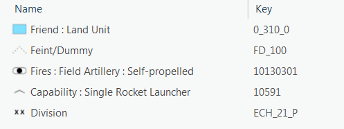
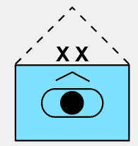
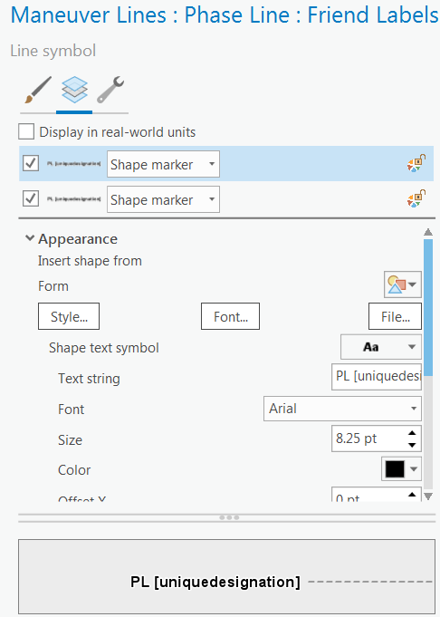

# Understanding the dictionary

## What is a dictionary?

A dictionary is a mobile style file (.stylx) that contains instructions that define how symbols are constructed based on multiple attributes. The instructions are a combination of the dictionary configuration file and the dictionary script which are both stored in the meta table of the style file. A dictionary allows you to author individual parts of a symbol that can then be combined by the instructions into many symbol permutations without having to author each complete symbol uniquely. This approach is useful when symbol specifications lead to many symbol permutations that would be inappropriate for unique value symbology.

## Dictionary style

For a dictionary to be used in Runtime the style file must be a mobile style file. The style should contain all the individual component symbols that will be combined to create the final symbols. These component symbols are identified by the unique key assigned to each item in the style.

For example, the MIL-STD-2525D dictionary style, which is included in ArcGIS Pro, contains individual component symbols such as the frames, main icons, modifiers, echelons, indicators. Components are combined together to create full symbols.

*Component symbols in a style*



*Final symbol*



The dictionary script defines the keys for the individual component symbols. These keys may be a combination of variables, attributes, string, etc. In the example above, the frame key, which returns the blue rectangle, is built by combining the values for context, identity, symbol set and status.

Frame key example code:
`concatenate([_context, '_', $feature.identity, _symbolset, '_', _status])`


Mobile style files that are used as dictionaries must contain the following fields in the `meta` table of the .stylx file:

**_dictionary_configuration_**

This is the configuration file that contains properties that are shown in the Dictionary symbology pane in ArcGIS Pro. The configuration file contains options for the configuration fields, such as the ability to turn the frame on and off. It includes a list of all the symbol and text properties in the symbology pane that can be connected to a field. The configuration file can be copied from the `meta` table in the .stylx file and edited in any text editor.

**_dictionary_script_**

The dictionary script is an Arcade script that contains instructions on how to use attribute values to build symbol keys. Symbol keys are used to look up symbols in the dictionary style. The collection of symbols identified by this process creates the final dictionary symbol. The dictionary script can be copied from the meta data table in the .stylx file and edited in any text editor.

**_dictionary_name_**

This is the name that shows in the Dictionary symbology pane in ArcGIS Pro.

**_dictionary_version_**

This is the version of the dictionary. The minimum version number for a custom dictionary is `2.0.0`.  This documentation covers version 3.0.0. For documentation of version 2.0.0, see the archived [branch](https://github.com/Esri/dictionary-renderer-toolkit/tree/release/2.0.0) of this repository. For details on how to upgrade a dictionary, see [Upgrading dictionary styles from a previous version
](docs\upgrading-dictionary-styles-from-a-previous-version.md). Version `3.0.0` or higher is required to share the dictionary as a web style.

**_arcade_version_**

The Arcade version indicates the minimum version of Arcade needed to consume the script. The minimum Arcade version for a custom dictionary is `1.5.0`.

## Dictionary configuration
This JSON object defines attributes that appear in the user interface to allow connection to database attributes. These attributes become available as attributes in the `$config` global variable.  

### Configuration
This section lists options that are not feature-dependent. Only text values are supported.

Example:
```
declaration
{
    "name": "icon",
    "value": "ON",
    "domain": ["ON", "OFF"],
    "info": "indicates if the icon is rendered"
}
```

Usage in the script:

`var _show_icon = $config.icon != 'OFF';`

### Symbol
The symbol attributes are used to control how to build symbol keys. The symbol attributes are just an array of strings. The order in the array defines the order in the user interface. Their values are available as attributes in the `$feature` global variable.

### Text
The text attributes are only used by the dictionary labels. They are not available as variables in the script.

*Labels are modeled as text elements in marker symbol layers in a symbol.*



There is a TextString property which can be used to contain an expression. If `uniquedesignation` is a string listed in the text attributes, you can use `PL [uniquedesignation]` as the expression. If the value mapped to `uniquedesignation` is `ABC`, the expression is evaluated as `PL ABC` and `PL ABC` is the text that shows on the map.

All the parts of the expression using square brackets are candidates for this substitution mechanism.

There is a custom behavior with the `text` configuration attribute. If the value is `OFF`, attributes are always substituted by an empty string. The example above shows as `PL` in this case.

## Dictionary script
The dictionary script is an Arcade script that returns a string. The string chains together different keys which should match symbols in the dictionary style. All the corresponding symbols are used to compose the final symbol representing the feature.

### Creating keys
You can use any Arcade function to produce the string you want. A key is used to retrieve a symbol from the style.

Examples:
This example uses the content of feature attributes directly:

`var key = concatenate([$feature.symbolset, $feature.symbolentity]);`

This example uses a mix of intermediate variables, feature attributes, and constant strings:

`var key = concatenate([_context, '_', $feature.identity, _symbolset_frame, _status]);`

### Returning multiple keys
Multiple keys are returned as a semi-colon separated string;
Example:
Assuming `_frame_key` and `_icon_key` are keys built in a previous part of the script:

`var keys = _frame_key + ";" + _icon_key;`

### Using alternate keys
Some symbol construction may be conditional, or two models may coexist for keys but only one is relevant. For instance, in the MIL-STD-2525D dictionary, some icons are independent of the frame shape, while some others are not. So, they have multiple symbols provided in the dictionary. The encoding of the key is either the raw entity number, or the entity number with a suffix representing the frame shape.

The script attempts to get the generic key, but if it is not found, it uses an alternate key. This is achieved by concatenating keys with the pipe (`|`) character.

Example:
```
keys += concatenate([
     concatenate([$feature.symbolset, $feature.symbolentity]), // non touching frames
     concatenate([$feature.symbolset, $feature.symbolentity, _affiliation_icon]) // touching frames - Both are provided because the existence of the icon cannot be queried.
    ], '|'); // use | as the separator
```

### Using overrides
The value returned by the script can also contain overrides. Overrides can be considered as a special key that starts with `po:` (for primitive override).

A primitive override is a way to change a symbol property value differently per feature. Parts of a symbol can be tagged with a primitive name (like an element name in WPF or HTML).  The primitive name can be added to the symbol parts in ArcGIS Pro by clicking on the *show primitive name* button on the structure tab in the catalog view. 

The syntax for a primitive override is `po:<primitive_name>|<property_name>|<value>` which means: for this symbol, replace `<property_name>` by `<value>` for all parts that are tagged `<primitive_name>`.  

In the MIL-STD-2525 dictionaries, the frame symbols have built-in primitive names to identify parts that belong to the fill (`frame_fill`) or the outline (`frame_outline`). They can then be colored by overriding the `Color` property.

Example:
```
   if (_show_fill) {
    keys += ';po: frame_fill|Color|';
    keys += _fill_color;
   }
```
Other examples can be found in the MIL-STD-2525 scripts that override offset or color with various other primitive names.
