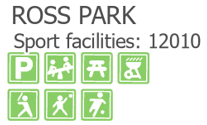
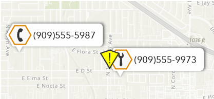

# Working with different field types

Before version `4.0.0`, the values for all attribute fields used in the dictionary were converted to string values regardless of the field type.  In version `4.0.0` of the dictionary, Arcade will receive the native data type of the attribute field which will give more control over the functionality of the operators used in the script. Honoring the native data types ensures that numbers, dates, and times are not impacted by localization and formatting changes the way string values are.

The `3.0.0` version of the dictionary is still supported. For dictionaries that consume string values or use Arcade operators that require strings there is no need to upgrade the dictionary. For steps for upgrading `3.0.0` dictionaries see [Upgrading dictionary styles from a previous version](docs/upgrading-dictionary-styles-from-a-previous-version.md).

## Numeric field example

The results for numeric data types may be different for some Arcade operators depending on if the values are received as the true numeric type or converted to string. For additional information see the [implicit casting rules](https://developers.arcgis.com/arcade/guide/type-casting/#implicit-casting) from Arcade.

An example of this can be seen in the [Park Amenities](../dictionary_examples/Park_Amenities) dictionary with the configuration to show the count for the number of sport facilities.  

In the script, there is a configuration option to show a count for the number of sport fields and courts available for the public at each park.  The count is derived by adding together the values in multiple numeric attribute fields.

```

// Show sport facility count
if (_show_sportfacilitycount) {
    var count = $feature.SOCCFOOT + $feature.BASKETBALL + $feature.BASEBALL + $feature.SOFTBALL + $feature.TENNIS;
	keys += ';sport_count_label';
	keys += ';po:sport_facility_count|TextString|';
        keys += 'Sport facilities: ' + count;
  
```

If numeric data values are converted to strings in the script and then used by the + operator, adding the values for the different sports facilities will result in the values being concatenated because the operator arguments are strings.



 
However, when the numeric data type is maintained as a number the values are summed. See [arithmetic statements](https://developers.arcgis.com/arcade/guide/type-casting/#arithmetic-statements) for details about the + operator and other arithmetic operators.


## Date field example

With a 3.0.0 dictionary, ArcGISPro will format date/time as a string like this (as seen in the Attribute Table).

10/13/2023 10:12:00 PM

This format doesn't convert easily to a date/time value in Arcade. As a result, it can be difficult to incorporate date/time fields in the script for anything more than labels.

A 4.0.0 dictionary will receive native date fields, which can be used with the [date functions](https://developers.arcgis.com/arcade/function-reference/date_functions/) Arcade operators directly.

An example of this can be seen with the [Service Calls](../dictionary_examples/Service_Calls) dictionary where the DateDiff operator is used to flag calls with a long wait time between when a call is received and when the call is dispatched.

The data has two date fields, one for when the call is received and one for when the call is dispatched. The differences between these two fields can be compared in the identified units. Calls that are dispatched more than 4 hours after they are received are flagged with an additional icon.

```
if (DateDiff($feature.DispatchTime, $feature.CallTime, 'hours')>4){
	keys += ';WARNING';	
```



If you need a string representation of the date/time, Arcade has more options to format the value to accommodate the rendering needs. See [text_functions](https://developers.arcgis.com/arcade/function-reference/text_functions/#text) for details.

