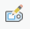
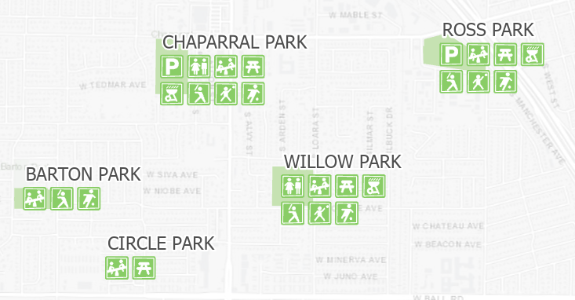
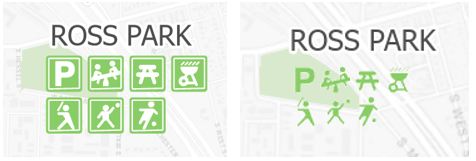
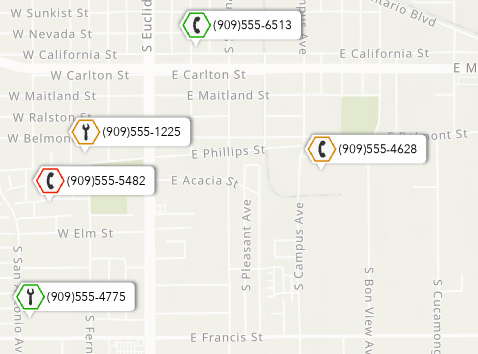
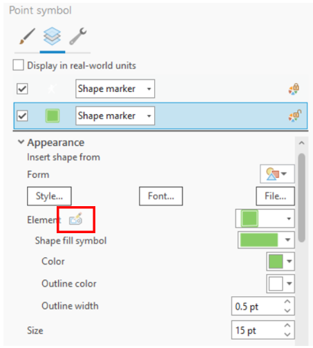

# Working with overrides in dictionaries

## Primitive overrides

A primitive override is a way to change a symbol property value differently per feature.  Parts of a symbol can be tagged with a primitive name, which can be used in the script to apply overrides to the parts that have that specified name.  Overrides can be considered as a special key that starts with `po:` (for primitive override).  Any symbol property that supports attribute-driven symbology in ArcGIS pro can be used as a primitive override in a dictionary.  These include but are not limited to Size, Color, Rotation, OffsetX and OffsetY.

The syntax for a primitive override is `po:<primitive_name>|<property_name>|<value>` which means: for this symbol, replace `<property_name>` by `<value>` for all parts that are tagged `<primitive_name>`.  The property name needs to match the CIM property name.  Names can be found in the [CIMSymbols specification](https://github.com/Esri/cim-spec/blob/master/docs/v2/CIMSymbols.md).  The first letter of the property will need to be capitalized.

The primitive name will apply to all the symbols identified with the keys. Symbols that share the same primitive name will have the same override applied.  An example of this can be seen in the [color override example](https://devtopia.esri.com/ArcGISPro/dictionary-renderer-toolkit/blob/main/docs/working-with-overrides.md#example-of-color-overrides) below.  

It is important to note that one primitive name equals one overridden value. Different override values cannot be applied to the same primitive name. To apply different values it is neccessary to have different primitive names. This is illustrated by the [offset override example](https://devtopia.esri.com/ArcGISPro/dictionary-renderer-toolkit/blob/main/docs/working-with-overrides.md#example-of-offset-overrides) below.

The reserved string, `countrylabel`, should not be used as a primitive name.  This is reserved to handle a special symbol/text duality case in military dictionaries.

## Adding primitive names to symbols in the dictionary

In order to apply an override to a symbol part, the part needs to have a primitive name assigned.  The primitive name can be set by editing the symbol in the catalog view in ArcGIS Pro.  Primitive names can only be set on dictionary styles.

1.	Add your custom dictionary style to ArcGIS Pro:  In ArcGIS Pro, on the Insert tab, in the Styles group, click Add and click Add Style. Browse to the custom dictionary style.  If you are using ArcGIS Pro 3.0 or higher, select yes when asked if you want to upgrade the style.

2.	Open the custom dictionary style: On the View tab, in the Windows group, click Catalog View to open a Catalog view. In the Contents pane of the Catalog view, expand the Styles folder and click the custom dictionary to open it.

3.	Add primitive name to symbol:    In the custom dictionary select the symbol.  In the Details panel click Properties.  On the Structure tab () click on the Show Primitive Name button ().  In the dialog add the name and click OK.

Primitive names can be added to any symbol layer or geometric effect that is on the structure tab.  Primitive names can also be added to the symbols that are embedded in the main symbol.  For example, they can be applied to the polygon symbol that is used for the fill in the point symbol.

1.	Edit the properties of an embedded polygon in a point symbol.  In the custom dictionary select the symbol.  In the Details panel click Properties.  On the Layers tab (), click on the gallery drop down for the Shape Fill Symbol and choose Format Polygon Symbol.

2.	Add primitive name to the polygon fill.  In the Format Embedded Polygon Symbol editor go to the Structure tab () and click on the Show Primitive Name button ().  In the dialog add the name and click OK.

## Where to add the primitive name in the symbol structure

Primitive overrides can be applied to properties at different levels in the symbol structure.  They can be applied at the main level of the symbol layer or the symbol that is embedded in the symbol layer.  For example, if you have point symbol that is composed of a marker symbol layer, that marker symbol layer has an embedded polygon symbol.  The primitive overrides can be applied at the marker level or at the embedded polygon level.  

Where you place the override depends on the property you are trying to override and how the overrides will be applied to individual symbols.  The primitive name should be placed at the level of the property you want to override.  Depending on what you are trying to achieve you may want to have the same override apply to multiple symbols, for example changing the color of a symbol.  Alternatively, you may want to have a specific override applied to individual symbols, for example a specific offset depending on the type of symbol.  If you want to combine these goals, it is necessary to have overrides at both the main symbol layer level and the embedded symbol layer level.  The example below will illustrate this.

## Example of offset overrides

The [Park Amenities](../dictionary_examples/Park_Amenities) dictionary symbolizes park features with a grid of points that represent the various amenities that are available at each park.  This dictionary has a configuration option to draw the icon for the amenity in a green frame or to draw just the icon.

*Park Amenities*



In the image above, the grids of amenity symbols illustrating what is at each park were built by offsetting the symbols into rows.    Overrides on the Offset X and Y properties of the markers are used to place the symbols side by side and stack them in rows.    

Each of the point symbols for the amenities has two marker symbol layers, one for the white icon representing the amenity and one for the green frame.  For the whole point symbol to be offset, both marker symbol layers need to have the same primitive name.  However, since a different value for the offset override will be applied to each amenity, the primitive names need to be unique for each one.  For example, the point representing Parking will have a primitive name of parking_marker assigned to both the white icon for the ‘P’ and to the green frame.  

To place the symbols side by side the Offset X property on the marker symbol layer is overridden.  A function can be written to define the X offset and to increment the value for each additional point symbol.  In the snippet below, the offsetRight variable starts with a value of 0 and increases by 15 for each additional amenity.  Since there is also an option to draw the points without the frame an alternative offset of 11 it specified.

```
// Variables
var offsetRight = 0;
var offsetBottom = 0;
var iconCount = 0;

// Calculating the semi-colon delimited keys now
var keys;

// Create rows of markers for the park amenities
function addOffsetOverrides(pn) {
    //Offset markers
    if (offsetRight != 0) {
        keys += ';po:' + pn + '|OffsetX|';
        keys += offsetRight;
    }
    if (_show_frame) {
        offsetRight += 15;
    } else {
        offsetRight += 11;
    }
 ```

To prevent the row of point symbols from getting to long, additional rows are created by applying a Y offset to the point symbols after 4 symbols are placed in a row.  In the snippet below, once the number of points reaches 4, the offsetBottom variable is incremented in the same way as the offsetRight variable and the offsetRight and iconCount variables are reset to zero.

```
   // Create a new row after 4 markers
    if (offsetBottom != 0) {
        keys += ';po:' + pn + '|OffsetY|';
        keys += offsetBottom;
    }
    iconCount += 1;
    if (iconCount == 4) {
        if (_show_frame) {
            offsetBottom -= 15;
        } else {
            offsetBottom -= 11;
        }
        // Reset offset for X and row count
        offsetRight = 0;
        iconCount = 0;
    }
```

When building the grid of symbols that represent the park amenities, the function above is called for each amenity specifying the primitive name (pn) for the marker symbol layers.

```
// Park amenities
if ($feature.PARKING == 'Yes') {
    keys += ';Parking';
    addOffsetOverrides('parking_marker');
}
if ($feature.RESTROOM == 'Yes') {
    keys += ';Restroom';
    addOffsetOverrides('restroom_marker');
}
...
```
The resulting key string for offsetting the icons for Ross Park would be:
`Parking;Playground;po:playground_marker|OffsetX|15;Picnic;po:picnic_marker|OffsetX|30;Barbeque;po:barbeque_marker|OffsetX|45;Baseball;po:baseball_marker|OffsetY|-15;Basketball;po:basketball_marker|OffsetX|15;po:basketball_marker|OffsetY|-15;Soccer;po:soccer_marker|OffsetX|30;po:soccer_marker|OffsetY|-15`

The primitive names used for the offsets, such as playground_marker, are unique to a single symbol so the offset can be applied to the individual amenities to create the grid. You cannot have multiple offset values applied using the same primitive name.


## Example of color overrides
In the Park Amenity dictionary, there is a configuration option to turn the green frames of the symbols off and draw only the icon.  This is accomplished by overriding the color depending on the setting of the ‘Show Frame’ configuration option.  

*Show Frame options*



If the Frame option is set to off, then a transparent color is applied to the fill of the icon.  Because the color of the marker symbol layers comes from the polygon symbol that is used for the fill shape it is necessary to put the primitive name on the embedded polygon symbol and not at the marker symbol layer level as in the offset example.  The primitive name ‘frame’ is applied to the green square and the white square outline symbol layers that compose the frame.  The primitive name is applied to both symbol layers so that they can be made transparent.  

Since the white icons would not be visible without the colored frame, the icon fill is changed to green.  For the icons a primitive name, ‘icon’, is applied to the fill layer of the polygon symbol used for the shape fill of the icon marker.  The primitive name is only applied to the fill of the polygon and not the outline.  When the override is applied, the icon is changed to green with a small white outline.

```
// Configuration
var _show_frame = $config.frame != 'OFF';
…
// Color icon and make from invisible
if (!_show_frame) {
    // Make frame transparent
    keys += ';po:frame|Color|';
    keys += '#89CD6600';
    // Change color of icons to green
    keys += ';po:icon|Color|';
    keys += '#89CD66';
}
```
The resulting key string for coloring the icons with the frame off for Ross Park would be:
`Parking;Playground;po:playground_marker|OffsetX|11;Picnic;po:picnic_marker|OffsetX|22;Barbeque;po:barbeque_marker|OffsetX|33;Baseball;po:baseball_marker|OffsetY|-11;Basketball;po:basketball_marker|OffsetX|11;po:basketball_marker|OffsetY|-11;Soccer;po:soccer_marker|OffsetX|22;po:soccer_marker|OffsetY|-11;Label;po:frame|Color|#89CD6600;po:icon|Color|#89CD66`

While the primitive names for the offsets are unique for each symbol allowing the offsets to be applied for the individual amenities, the primitive names for the frame and icon are the same for all the symbols.  This allows for the color to be globally overridden for all symbols.


Another example of a color override is in the [Service Calls](../dictionary_examples/Service_Calls) dictionary where the color of the symbol is driven by the value in an attribute field.  In this dictionary, services are symbolized base on the type of call and the status of the call.  The type of call dictates the icon in the center of the hexagon while status controls the color of the outline on the hexagon.

*Service Calls*



In this case, the color is driven by the value in the Status field of the data.  The Decode function is used to convert the value in the Status field to the color that is used and assign a default color for any statuses not defined.  Please see https://developers.arcgis.com/arcade/function-reference/logical_functions/#decode for more information on the function.

```
// Define variables
var _color = decode($feature.status, 'New', '#F02200', 'In progress', '#DB8700', 'Completed', '#16AD00', '#909090');
var _assist = $feature.type == 'Needs assistance';
var _repair = $feature.type == 'Repair';

// Build keys
var keys = 'CALLOUT_;CALLOUT';
keys += ';BORDER;po:status|Color|' + _color;
keys += ';FILL';

if (_assist)
    keys += ';PHONE';
if (_repair)
    keys += ';WRENCH';

keys += ';NUMBER';
return keys;
```


**Tip:**

There is a special case where there is an extension to the CIM for how color overrides are applied to marker graphics.  In this case property name does not match a CIM property name.  If you use a color override at the marker graphic level, you will need to use `FillColor` for the fill color and `StrokeColor` for the outline color.  This only applies if you place the primitive name at the marker graphic level, which is highlighted in the red in the image below.  For all other cases, the property name will be `Color` as shown in the examples above.

*Primitive name on marker graphic location*




